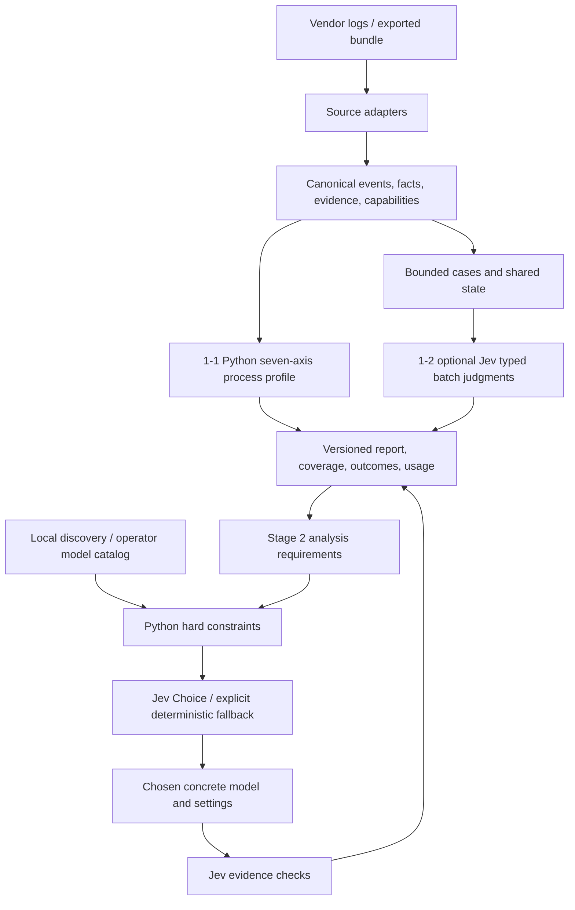

# session-health Jev design

## Data flow

圖中的回寫是有界分階段輸出，不是無限 agent loop；postcheck 只讀凍結的分析產物與原始證據，最多一次修正。

## Modules and contracts

- `parser_base` 與新 bundle/schema 模組：typed records、source refs、能力與未知值、序列化。
- `metrics`/`scorer`：legacy＋process-v2；觀察量與語意輸出分層，沒有隱藏混合總分。
- `semantic_features`/case builder：廣取候選、建立目標/失敗/宣告證據關係；inferred edges 不冒充 observed links。
- `jev_questions`：有版本的七軸題組、選模與 postcheck 題組；獨立問題共享 state。
- `semantic_backend`/`jev_analysis`：能力宣告、標準庫 HTTP、schema/range validation、timeouts/retries、ledger。
- `model_catalog`/`model_router`：探測與明示候選、時效、硬條件、Jev Choice、override、失敗替代。
- `agent_analysis`：固定 argv/stdin transport，具體 model/settings、actual identity/usage、結構化分析與有界 postcheck。
- `report_types`/renderers/CLI：同一結果模型，保持全部 session 狀態及 portable export/import。

檔名可依最小變更調整，但 contracts 與責任不可省略。無 framework、graph DB、vector DB 或 mandatory SDK；model catalog 是普通版本化資料，不複製 Cortex 的控制面。

## Compatibility and acceptance state

Legacy 欄位 additive；process-v2 新語義帶版本。Reader 拒絕不支援的 major bundle version，保留未知能力而不猜。跨機重播不依賴絕對 source 路徑。Generic backend native/emulated/unsupported 明示，不把生成模型自報 confidence 當原生分布。

已知風險：parser 和候選配對可能漏失、繁中語意待 pilot、同源 Jev 的前後判讀錯誤可能相關、可用模型目錄可能過期、遠端 timeout 用量可能未知；各項對應 coverage、provenance、freshness、棄權及台帳，不以文案當測試替代。

## Verification

完整行為與測試在 [accepted plan](../plans/session-health-jev.md)。Builder 要產生真實 RED/GREEN 記錄；agy 在 exact candidate 上驗證高影響失敗案例，root 另跑 integration/E2E。沒有實測的平台/API 必須明示 deferred。
